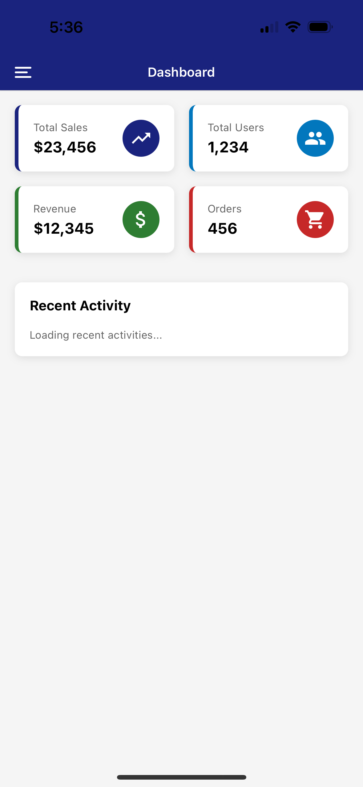
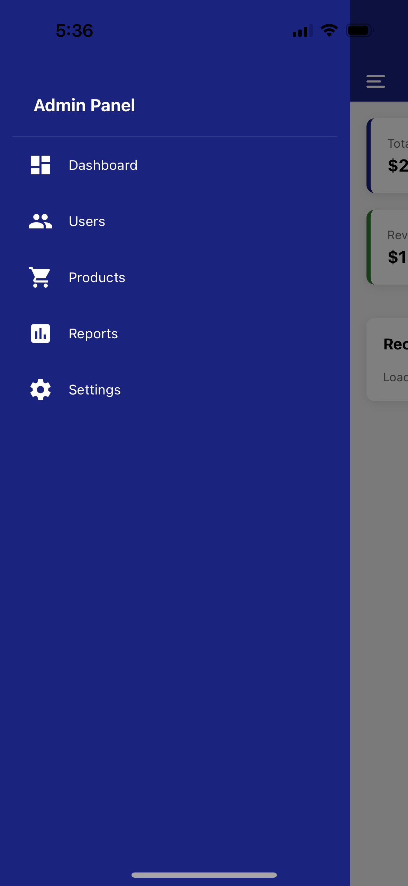
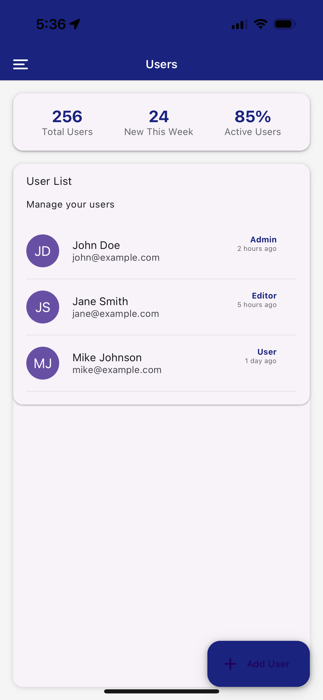
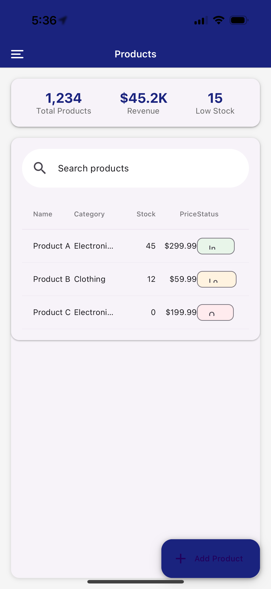
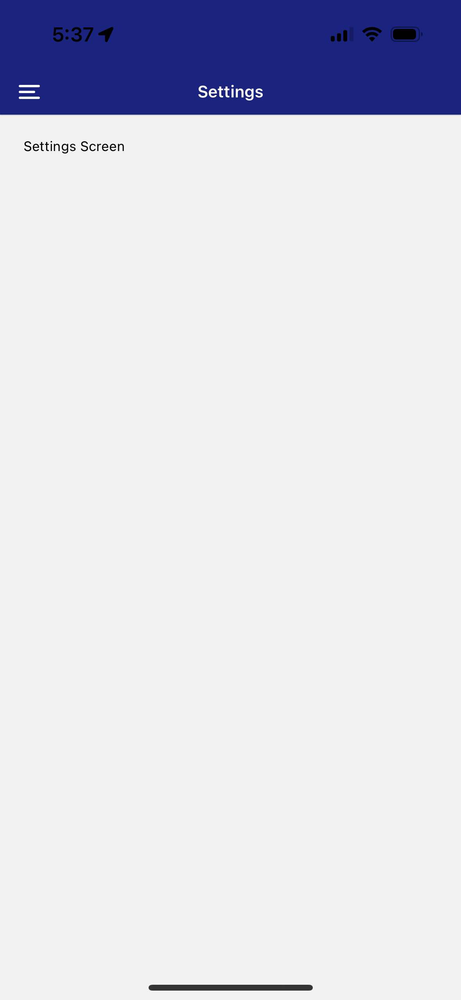

# Admin Dashboard UI

[](https://github.com/pmvita/admin-dashoard_v3)
[](https://reactjs.org/)
[](https://reactnative.dev/)
[](https://expo.dev/@pmvita/admin-dashoard_v3)
[](https://www.npmjs.com/package/admin-dashoard_v3)
[](https://yarnpkg.com/)
[](https://play.google.com/store/apps/details?id=com.admin.dashoard_v3)
[](https://apps.apple.com/us/app/admin-dashoard_v3/id1636008002)


## 📝 Description

This is a dashboard for an admin panel, built with React Native and Expo. It includes features such as a sidebar, navigation, authentication, and a user management system.

## 📷 Screenshots

<div align="center">
  <table>
    <tr>
      <td>
        
        <text style="font-size: 13px;" >Dashboard Screen</text>
      </td>
      <td>
        
        <text style="font-size: 13px;" >Admin Panel</text>
      </td>
      <td>
        
        <text style="font-size: 13px;" >User's Screen</text>
      </td>
    </tr>
    <tr>
      <td>
        
        <text style="font-size: 13px;" >Products Screen</text>
      </td>
      <td>
        
        <text style="font-size: 13px;" >Reports Screen</text>
      </td>
      <td>
        
        <text style="font-size: 13px;" >Settings Screen</text>
      </td>
    </tr>
  </table>
</div>

## 🚀 Installation

```bash
yarn install
```
```bash
yarn start
```


## 🤝 Contributing

Contributions are welcome! Please feel free to submit a Pull Request.

1. Fork the project
2. Create your feature branch (`git checkout -b feature/AmazingFeature`)
3. Commit your changes (`git commit -m 'Add some AmazingFeature'`)
4. Push to the branch (`git push origin feature/AmazingFeature`)
5. Open a Pull Request

## 📝 License

This project is licensed under the MIT License - see the [LICENSE](LICENSE) file for details.

## 👥 Authors

- Pierre Mvita - [Pierre Mvita](https://github.com/pmvita)

## 🙏 Acknowledgments

- React Native team
- Expo team
- React Navigation team
- All contributors and supporters
